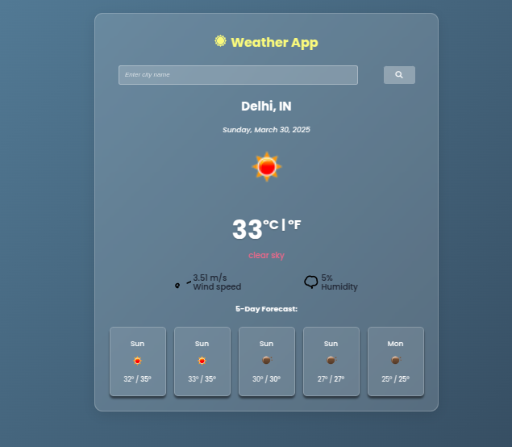

# Weather App



## Overview
A responsive weather application built with React.js that displays current weather conditions and a 5-day forecast for any location. This app uses the OpenWeatherMap API to fetch real-time weather data.

## Features
- Current weather display (temperature, conditions, humidity, wind speed)
- 5-day forecast with min/max temperatures
- Location-based weather data
- Clean, user-friendly interface
- Responsive design for all device sizes

## Technologies Used
- **Frontend**: React.js, HTML5, CSS3
- **API**: OpenWeatherMap API
- **Build Tools**: npm, Webpack

## Installation
1. Clone the repository:
   ```bash
   git clone https://github.com/yourusername/weather-app.git